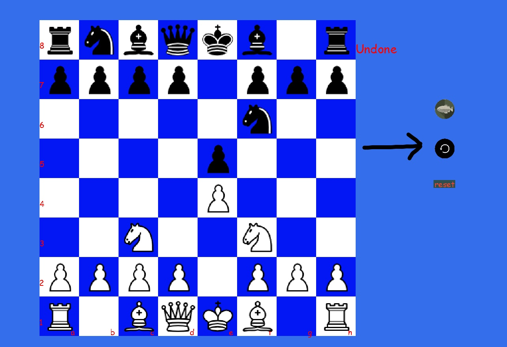

# ****Simple Chess GUI****
 A simple chess game written from scratch in python. Code seems shitty and long but gets the job done. It uses the `chessdb.cn`'s api for suggested engine moves. Made for analysis and study purposes.

## Prerequireties
This project is only tested on python3. You can install the requireties with `python3 -m pip install -r requirements.txt`.

## How to play
Simply type `python3 chess.py` to play.

# **Customizables**
The variables in the first lines in chess.py  `background_color, warning_color, stockfish_color, highlight_color, white_square_color, black_square_color, notation_text_color` `notation_text_font, notation_number_font, font_reset, warning_font` can be and **should** be customized for better use.

# **Features**
## Stockfish
This game uses chessdb.cn's evaluation API. An ugly button on the right side starts and stops the engine. With the engine on, moves are laggy because of the python's `requests` library. In the future, this might be solved.The first six engine moves are displayed under the board.

                    
                    

## Undo
With the revert button on the right side, you can undo your moves for both color.

    

## Reset
And finally, you can reset the board. But this option also clears `logs[]`.

